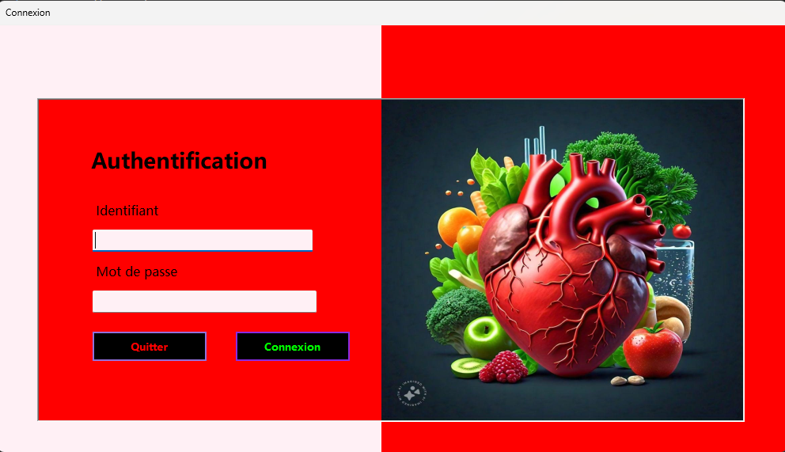
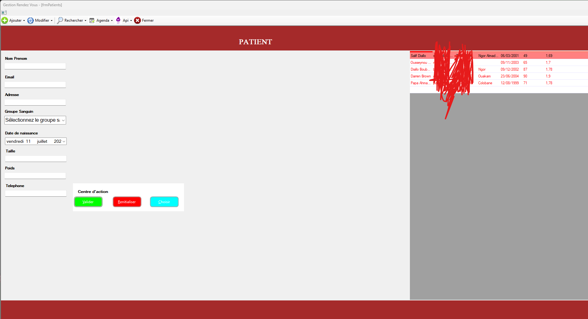
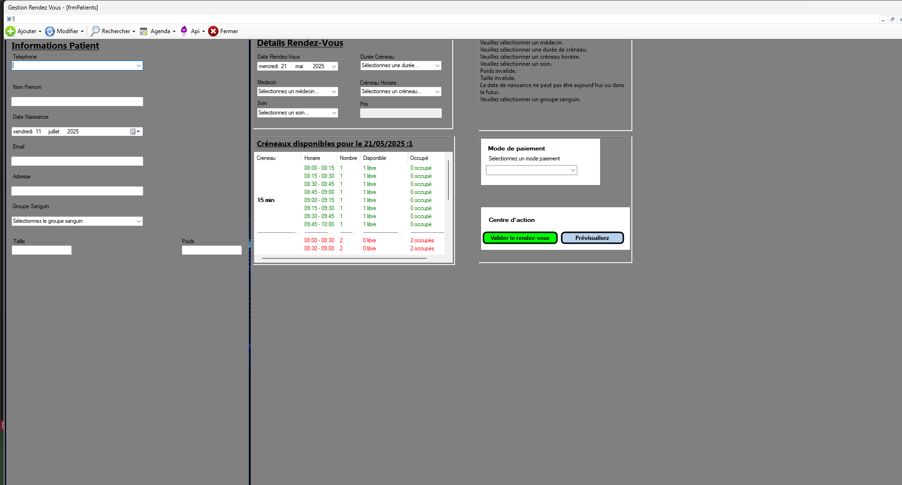

# 🏥 GestionRvMedical

**GestionRvMedical** est une application de bureau développée en C# (.NET Framework) avec Windows Forms. Elle permet de gérer efficacement les rendez-vous médicaux dans une clinique ou un cabinet, incluant la gestion des patients, médecins, paiements, et l'impression des tickets.

## 📸 Aperçu





---

## 🚀 Fonctionnalités principales

- 📅 Création et planification de rendez-vous
- 👩‍⚕️ Gestion des patients et des médecins
- 💰 Suivi des paiements
- 🖨️ Impression des tickets de rendez-vous
- 🧠 Architecture en couches (UI, métier, données)

---

## 🧰 Technologies utilisées

- C# avec .NET Framework
- Windows Forms (WinForms)
- Entity Framework (via NuGet)
- SQL Server
- Crystal Reports (pour l'impression des tickets)

---

## 📦 Prérequis

- Visual Studio 2019 ou version supérieure
- .NET Framework 4.7.2 ou plus récent
- SQL Server (LocalDB ou version complète)
- [Crystal Reports Runtime](https://www.crystalreports.com/download/) (si impression activée)

---

## 🛠️ Installation & Lancement

### 1. Cloner le projet

```bash
git clone https://github.com/MrSalifDiallo/GestionRvMedical.git
cd GestionRvMedical
```
### 🧰 Restauration des dépendances NuGet

### 2.Après avoir cloné le projet, ouvrez la Console du Gestionnaire de Package dans Visual Studio :

```powershell
Update-Package -reinstall
```
### Migration Base Donnée (Nuget)
```bash
Enable-Migrations -ContextTypeName BdrvMedicalContext
Update-Database -Verbose

```

## 👤 Auteurs

- **Salif Diallo**  Développeur principal
      📧 [salifdiallo@esp.sn](mailto:salifdiallo@esp.sn)  
      🔗 [GitHub - MrSalifDiallo](https://github.com/MrSalifDiallo)  
      🌍 Basé à Dakar, Sénégal

- **Papa Ahmadou Fall**  Mise en Place Front-End(RV)
      🔗 [GitHub - papaahmadoufall](https://github.com/papaahmadoufall)  
      🌍 Basé à Dakar, Sénégal

